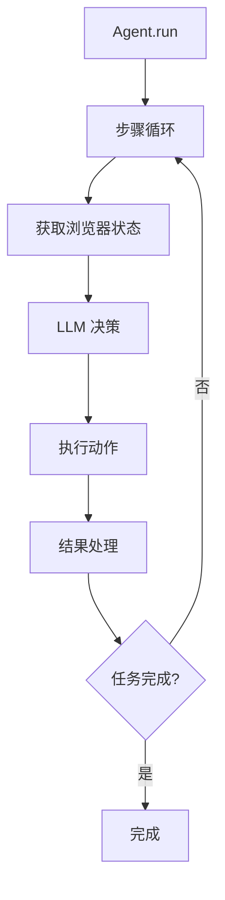
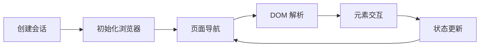

# Browser-Use 项目概览与开发指南

## 项目简介

Browser-Use 是一个基于 AI 的浏览器自动化框架，支持智能网页操作、测试自动化和 Web 任务执行。该项目集成了多种 LLM 模型，提供了完整的浏览器会话管理、DOM 解析、元素交互等功能。

## 核心功能模块

### 1. 智能代理系统 (Agent)

- **位置**: `browser_use/agent/`
- **核心文件**: `service.py` (主要代理逻辑，约 1100+行)
- **功能**:
  - 基于 LLM 的智能决策
  - 多步骤任务执行
  - 视觉理解和页面分析
  - 错误恢复和重试机制
  - 支持结构化输出

### 2. 浏览器会话管理 (Browser)

- **位置**: `browser_use/browser/`
- **核心文件**:
  - `browser.py` - 浏览器实例管理
  - `session.py` - 会话生命周期
  - `profile.py` - 浏览器配置文件
- **功能**:
  - Playwright 集成
  - 多标签页管理
  - 下载文件跟踪
  - 截图和状态记录

### 3. DOM 处理系统 (DOM)

- **位置**: `browser_use/dom/`
- **核心文件**: `service.py`
- **功能**:
  - 可交互元素识别
  - DOM 树解析和简化
  - 元素选择器生成
  - 历史状态管理

### 4. 控制器系统 (Controller)

- **位置**: `browser_use/controller/`
- **功能**:
  - 动作注册表管理
  - 页面特定动作过滤
  - 动作模型生成

### 5. LLM 集成层 (LLM)

- **位置**: `browser_use/llm/`
- **支持的模型**:
  - OpenAI (ChatGPT)
  - Anthropic (Claude)
  - Google (Gemini)
  - Azure OpenAI
  - AWS Bedrock
  - Groq
- **功能**:
  - 统一 LLM 接口
  - 结构化输出支持
  - 成本计算和追踪

### 6. 测试代理框架 (Test Agent) ⭐ 最新开发

- **位置**: `browser_use/test_agent/`
- **状态**: 🚧 开发中，已解决关键问题
- **核心组件**:
  - `core/executor.py` - 测试执行器
  - `core/intervention.py` - 人工干预处理
  - `cli/interface.py` - 命令行接口
- **功能**:
  - 自动化前端测试
  - 人工干预支持
  - YAML 配置管理
  - 超时控制 (已优化至 600 秒)

## 当前开发进度

### ✅ 已完成功能

1. **核心代理系统** - 稳定运行
2. **浏览器自动化** - 完整实现
3. **多 LLM 支持** - 广泛兼容
4. **DOM 解析系统** - 高效准确
5. **文件系统集成** - 支持文件操作
6. **测试代理框架** - 基础功能完成

### 🔧 最近修复的问题

1. **超时问题** - 将步骤超时从 30 秒优化至 600 秒
2. **浏览器会话管理** - 修复退出问题
3. **错误报告** - 增强错误信息详细度
4. **内存监控** - 优化资源使用

### 🚧 正在开发

1. **测试代理稳定性** - 完善错误处理
2. **性能优化** - 减少响应时间
3. **扩展功能** - 新的交互能力

### 📋 待开发功能

1. **批量测试支持**
2. **测试报告生成**
3. **集成测试框架**
4. **可视化测试界面**

## 文件结构详解

```
browser-use/
├── 📁 browser_use/                    # 核心包
│   ├── 🤖 agent/                      # 智能代理模块
│   │   ├── service.py                 # 主代理逻辑 (1100+ 行)
│   │   ├── prompts.py                 # 系统提示词
│   │   ├── views.py                   # 代理视图
│   │   ├── memory/                    # 记忆管理 (已弃用)
│   │   └── message_manager/           # 消息管理
│   │
│   ├── 🌐 browser/                    # 浏览器管理
│   │   ├── browser.py                 # 浏览器实例
│   │   ├── session.py                 # 会话管理
│   │   ├── profile.py                 # 配置文件
│   │   ├── context.py                 # 上下文管理
│   │   └── utils/                     # 工具函数
│   │
│   ├── 🌳 dom/                        # DOM 处理
│   │   ├── service.py                 # DOM 服务
│   │   ├── utils.py                   # DOM 工具
│   │   ├── clickable_element_processor/ # 可点击元素处理
│   │   ├── dom_tree/                  # DOM 树管理
│   │   └── history_tree_processor/    # 历史处理
│   │
│   ├── 🎮 controller/                 # 控制器
│   │   ├── service.py                 # 控制服务
│   │   ├── views.py                   # 控制视图
│   │   └── registry/                  # 动作注册表
│   │
│   ├── 🧠 llm/                        # LLM 集成
│   │   ├── base.py                    # 基础接口
│   │   ├── messages.py                # 消息处理
│   │   ├── schema.py                  # 数据模式
│   │   ├── anthropic/                 # Claude 集成
│   │   ├── google/                    # Gemini 集成
│   │   ├── azure/                     # Azure OpenAI
│   │   └── aws/                       # AWS Bedrock
│   │
│   ├── 🧪 test_agent/                 # 测试代理框架 ⭐
│   │   ├── core/
│   │   │   ├── executor.py            # 测试执行器 (主要逻辑)
│   │   │   └── intervention.py        # 人工干预处理
│   │   ├── cli/
│   │   │   └── interface.py           # 命令行接口
│   │   └── config/                    # 配置管理
│   │
│   ├── 📁 filesystem/                 # 文件系统
│   ├── 🔗 integrations/               # 第三方集成
│   ├── 📊 telemetry/                  # 遥测数据
│   └── 🪙 tokens/                     # 令牌管理
│
├── 📝 examples/                       # 示例代码
│   ├── simple.py                      # 基础示例
│   ├── mydemo.py                      # 用户演示
│   ├── BSAgent.py                     # BS 代理
│   └── browser/                       # 浏览器示例
│
├── 🧪 tests/                          # 测试代码
├── 📚 docs/                           # 文档
├── 🐳 docker/                         # Docker 配置
└── 📋 eval/                           # 评估工具
```

## 关键技术架构

### 代理执行流程



### 浏览器会话生命周期



## 配置与使用

### 环境配置

```yaml
# test_agent_config.yaml 示例
llm_config:
  provider: "openai"
  model: "qwen-vl-max"
  base_url: "https://yunwu.zeabur.app/v1"
  api_key: "${OPENAI_API_KEY}"

timeout: 600 # 10 分钟超时
max_steps: 20
use_vision: true
```

### 快速开始

```python
from browser_use import Agent
from langchain_openai import ChatOpenAI

# 初始化 LLM
llm = ChatOpenAI(
    model="qwen-vl-max",
    base_url="https://yunwu.zeabur.app/v1"
)

# 创建代理
agent = Agent(
    task="登录网站并执行操作",
    llm=llm
)

# 执行任务
result = await agent.run(max_steps=20)
```

## 开发指南

### 核心原则

1. **模块化设计** - 每个功能独立封装
2. **异步优先** - 所有 I/O 操作使用 async/await
3. **错误处理** - 完善的异常捕获和恢复
4. **可观测性** - 详细的日志和遥测
5. **可扩展性** - 支持插件和自定义动作

### 添加新功能

1. **新动作类型**: 在 `controller/registry/` 添加
2. **新 LLM 提供商**: 在 `llm/` 下创建子模块
3. **新集成**: 在 `integrations/` 下实现
4. **新测试**: 在 `tests/` 下编写测试用例

### 最佳实践

1. **使用类型提示** - 所有函数都要有类型注解
2. **编写测试** - 新功能必须有单元测试
3. **文档更新** - 及时更新 README 和 API 文档
4. **性能考虑** - 避免阻塞操作，使用缓存
5. **安全意识** - 敏感数据加密，输入验证

## 已知问题与解决方案

### 1. 超时问题 ✅ 已解决

- **问题**: 30 秒超时导致代理中断
- **解决**: 增加到 600 秒，支持复杂操作

### 2. 浏览器会话管理 ✅ 已解决

- **问题**: 人工干预后浏览器退出
- **解决**: 优化会话生命周期管理

### 3. 页面识别 🔧 持续优化

- **问题**: 页面跳转后识别为空白
- **解决**: 增强 DOM 解析和状态检测

## 社区与贡献

### 贡献指南

1. Fork 项目
2. 创建功能分支
3. 编写代码和测试
4. 提交 Pull Request
5. 代码审查

### 支持渠道

- GitHub Issues
- 技术文档
- 示例代码
- 社区讨论

## 未来路线图

### 短期目标 (1-2 月)

- [ ] 测试代理功能完善
- [ ] 性能优化
- [ ] 更多示例和文档

### 中期目标 (3-6 月)

- [ ] 可视化测试界面
- [ ] 批量测试支持
- [ ] 云端部署方案

### 长期目标 (6+ 月)

- [ ] 企业级功能
- [ ] AI 能力增强
- [ ] 生态系统建设

---

**注意**: 此文档基于当前开发状态生成，随着项目发展会持续更新。开发者在使用前请确认最新版本的功能和 API。

**最后更新**: 2025 年 7 月 14 日
**文档版本**: v1.0
**项目状态**: 积极开发中
